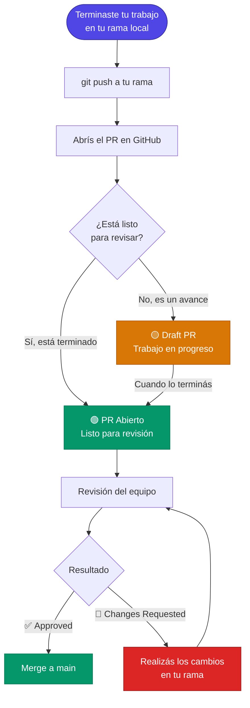

#  Pull Requests

El código se escribe para las máquinas, pero se revisa para los humanos. Los PR son nuestra principal herramienta de aprendizaje y calidad colectiva.

**📖 ¿Qué es exactamente un Pull Request?**

En términos simples, un Pull Request es una **solicitud formal** que le hacés al equipo para que revisen los cambios en los que estuviste trabajando (en tu rama personal) y los integren a la versión oficial del proyecto (la rama `main`).

No es solo una entrega de archivos; es un **espacio de colaboración virtual**. Al abrir un PR, se crea un entorno donde el equipo puede leer línea por línea lo que escribiste, hacer preguntas, proponer mejoras, y donde los sistemas automáticos verifican que el código nuevo no rompa nada de lo que ya funcionaba.

---

## 🎯 Objetivo y Contexto

> [!NOTE]
> Un Pull Request bien estructurado ahorra tiempo a los revisores y acelera la integración de nuevas funcionalidades. El objetivo es proporcionar suficiente contexto para que cualquier miembro del equipo pueda entender **qué** se hizo y **por qué** se tomó esa dirección técnica, facilitando la detección de errores antes de que el código sea integrado a `main`.

---

## 🌟 Reglas

> [!IMPORTANT]
> Las siguientes directrices son el estándar mínimo para abrir un PR en cualquier repositorio de la organización.

* **PRs Atómicos y Pequeños:** Un PR debe resolver una sola tarea o Issue. Es preferible abrir tres PRs pequeños que uno gigante; son más fáciles de revisar y menos propensos a errores.
* **La Regla de las Tres Patas:** Todo cambio funcional debe incluir tres cosas: el código, las pruebas automáticas que lo validan, y la actualización de la documentación correspondiente. Si falta alguna de las tres, el PR está incompleto.
* **Descripción con Contexto:** No asumas que el revisor sabe lo que tenés en la cabeza. Explicá la lógica detrás de tus cambios, especialmente si tomaste una decisión de diseño compleja.
* **Auto-Revisión Obligatoria:** Antes de solicitar una revisión, leé tu propio código en la interfaz de GitHub. Es el momento ideal para limpiar `print()`, comentarios de depuración o errores tipográficos.
* **Comunicación Constructiva:** Las revisiones son para el código, no para la persona. Sé amable al comentar y mantené una actitud abierta ante las sugerencias de mejora.

---

## 🛠️ Implementación y Ejemplos

### ✅ Prácticas correctas

Un buen PR debe seguir una estructura clara que guíe al revisor. Siempre utilizá la plantilla predefinida si está disponible.

```markdown
## 📝 Descripción
Se implementó el pre-procesamiento de señales EEG usando un filtro Notch. 
Esto soluciona el ruido de 50Hz detectado en las últimas capturas de datos.

## 💡 Motivación y Contexto
Los datos actuales presentan una interferencia alta en la frecuencia de red. 
Se optó por este filtro sobre un paso banda para preservar las frecuencias altas 
necesarias para el análisis posterior.

## 🧪 ¿Cómo se probó?
- [x] Ejecuté `pytest tests/test_filters.py` y todas las pruebas pasaron.
- [x] Validado visualmente con el script `scripts/visualize_eeg.py`.
- [x] Los docstrings fueron actualizados.

## 🔗 Issues Relacionados
Fixes #42
```

### ❌ Prácticas desaconsejadas

```markdown
# ERROR: Descripción vacía o insuficiente
Título: "Actualización"
Descripción: "Cambié un par de cosas en el código."
# Obliga al revisor a adivinar la intención del cambio.

# ERROR: PR no atómico (mezcla temas sin relación)
- feat: agrega login
- fix: ahora sí funciona
- feat: agrega base de datos
# Demasiados temas en un PR; si uno falla, bloquea todo lo demás.
```

---

## 🔄 El Ciclo de Vida de un PR

### Diagrama de flujo



---

### Paso a paso

**1. Subir los cambios**

Una vez terminés tu trabajo en local, subí tu rama a GitHub:

```bash
git push origin mi-rama
```

---

**2. Crear el PR**

Entrá al repositorio en GitHub. Vas a ver un banner amarillo sugiriendo crear el PR a partir de tu rama recién subida. Hacé clic en <kbd>Compare & pull request</kbd>.

---

**3. ¿Draft o PR directo?**

Acá está la decisión clave. Pensalo como el estado de un documento:

| Situación | Qué usar |
|:---:|:---:|
| El código está terminado y validado | PR normal → <kbd>Create pull request</kbd> |
| Subís un avance o querés respaldo, pero no terminaste | Draft PR → ver pasos abajo |

**¿Cómo abrir un Draft PR?**

Un Draft es como poner el documento en modo borrador. Le dice al equipo *"estoy trabajando en esto"*, pero **bloquea el botón de Merge** para que nadie integre el código por accidente y **no envía notificaciones de revisión** hasta que vos lo habilites.

Para crearlo: en lugar de hacer clic en el botón verde <kbd>Create pull request</kbd>, hacé clic en la **flecha pequeña** que está a su derecha y seleccioná <kbd>Create draft pull request</kbd>.

> [!TIP]
> Usá el Draft PR cuando quieras subir código a mitad de camino para que quede respaldado en GitHub, o cuando necesitás mostrarle a alguien un avance sin que ese código pueda mezclarse con `main` por error.

---

**4. Marcar como listo para revisión**

Cuando el código esté finalizado y la plantilla completa, abrí tu Draft PR en GitHub y hacé clic en el botón <kbd>Ready for review</kbd>. Esto notifica oficialmente a los revisores que pueden empezar a evaluar.

---

**5. Ciclo de feedback**

* **Approved ✅** — El código fue aprobado. Listo para fusionar.
* **Changes Requested 📝** — Hay correcciones pendientes. Realizá los cambios en tu rama y subí el commit; el PR se actualizará automáticamente sin necesidad de cerrar y abrir uno nuevo.

---

**6. Merge**

Una vez aprobado y con las pruebas automáticas en verde, se realiza la integración a `main`.

> [!WARNING]
> Nunca hacer merge si alguna prueba automática está fallando (luz roja en el PR), aunque el código haya sido aprobado por el revisor. Código aprobado + pruebas rotas = problema en producción.

---

## 💡 Tips para Revisar Código

Si te toca actuar como revisor:

* **Preguntá en lugar de ordenar:** En lugar de "Cambiá esto", probá con "¿Qué te parece si usamos X aquí para mejorar la legibilidad?".
* **Celebrá lo bueno:** Si ves una solución elegante o código muy limpio, ¡comentalo! Un cumplido técnico motiva al autor a mantener la calidad.

---

> [!NOTE]
> **Protección de ramas** — Para que este flujo funcione correctamente, los repositorios de la organización deben tener reglas de protección configuradas en `main` que fuercen el uso de PRs y aprobaciones. La configuración detallada se encuentra en `repository-setup.md`.

---

## 📎 Atribuciones

Íconos por <a href="https://icons8.com">Icons8</a>