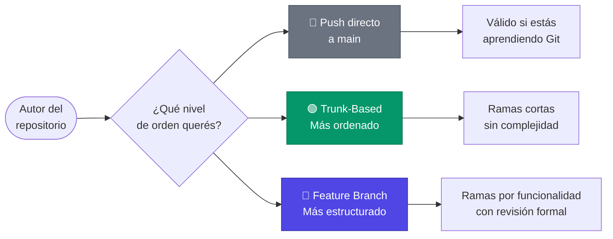
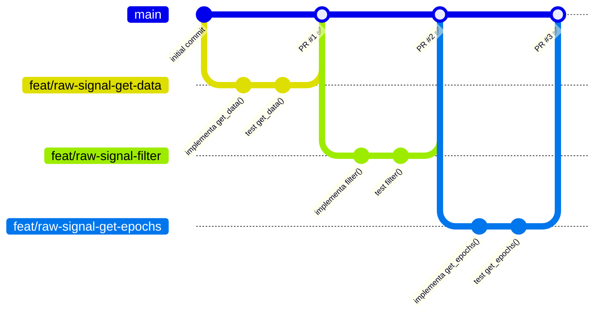
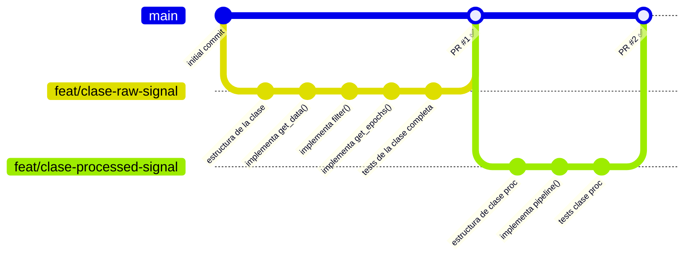

#  Estrategia de Ramas

Una rama en Git es como una línea de tiempo paralela del proyecto. Te permite trabajar en algo nuevo o experimental sin tocar la versión oficial que ya funciona. Esta guía define cómo se usan esas ramas dentro de la organización.

---

## 🎯 Objetivo y Contexto

> [!NOTE]
> Esta guía no impone una única forma de trabajar. El modelo de la organización reconoce que cada colaborador tiene un nivel distinto de experiencia en Git, y que los repositorios pueden recibir aportes de personas con distintos roles. Las reglas se aplican según ese rol, no de forma uniforme a todos.

Dentro de la organización conviven dos tipos de colaboradores en cualquier repositorio:

| Rol | Quién es | Libertad de trabajo |
|:---:|:---:|:---:|
| 👤 **Autor** | El estudiante o investigador dueño del proyecto | Trabaja como prefiera dentro de su repositorio |
| 🤝 **Colaborador** | Quien viene a aportar en un repositorio ajeno | Obligado a usar ramas y Pull Request, sin excepción |

Este modelo garantiza que quien recién empieza con Git no se vea forzado a dominar un flujo avanzado para trabajar en su propio proyecto, mientras que los aportes externos siempre llegan de forma ordenada, revisable y segura.

---

## 🌟 Reglas

### Para el Autor del repositorio

El repositorio es tuyo, pero pertenece a la organización. Esto significa que **todos los estándares organizacionales aplican sin excepción**: la estructura del proyecto, los Conventional Commits y, si usás Pull Requests, las reglas de PR de la organización. Lo que sí es flexible es la estrategia de ramas: si preferís hacer push directo a `main` mientras aprendés o mientras el proyecto no recibe colaboración externa, eso es completamente válido.

Si el proyecto va a recibir colaboradores, configurar la protección de ramas y la plantilla de PR es una responsabilidad del autor **antes** de que llegue el primer aporte. No es algo que el colaborador puede asumir que ya está configurado.

A medida que ganes experiencia, esta guía ofrece dos vías de trabajo más ordenadas que podés adoptar cuando te sientas listo.

### Para Colaboradores en repositorios ajenos

> [!IMPORTANT]
> Las siguientes reglas son obligatorias para cualquier persona que aporte código en un repositorio del que no es autor, ya sea otro estudiante, un investigador o el director del laboratorio.

* **Nunca hacer push directo a `main`:** Todo aporte llega mediante una rama y un Pull Request. Esto protege el trabajo del autor y genera un registro claro de quién hizo qué cambio y por qué.

* **Nombres de rama descriptivos:** El nombre de la rama debe comunicar su propósito de un vistazo, usando el formato `<tipo>/<descripcion-corta>` en `kebab-case`. (Ver [Convención de nombres](#nombres))

* **Una rama, una tarea:** Cada rama debe corresponder a un único propósito. Mezclar temas en una misma rama complica la revisión y el historial.

* **Ramas de vida corta:** Una rama que acumula demasiada lógica nueva genera conflictos al integrarse. El tiempo que vive una rama no es el problema en sí — podés tener una rama abierta varios días por interrupciones normales del trabajo — sino cuánto creció su lógica respecto a `main` sin integrarse.

---

## 🛤️ Vías de Trabajo para el Autor

Si sos el autor de un repositorio y querés trabajar de forma más ordenada o profesional, la organización propone dos vías según tu nivel y los objetivos del proyecto. Ninguna es obligatoria, pero ambas son buenas prácticas que vale la pena adoptar progresivamente. 
> [!NOTE]
> El push directo a main no es una vía de trabajo en sí, sino un punto de partida válido mientras se aprende Git.



| | 📌 Push directo | 🟢 Trunk-Based | 🔵 Feature Branch |
|:---:|:---:|:---:|:---:|
| **Ideal para** | Aprender Git, proyectos personales simples | Querer orden sin complejidad extra | Proyectos colaborativos o de mayor escala |
| **Complejidad Git** | Ninguna | Baja | Media |
| **Historial** | Lineal, sin ramas | Ordenado y trazable | Ordenado por funcionalidad |

---

## 🟢 Trunk-Based Development

### ¿Qué es?

Seguís trabajando en una única rama principal (`main`), pero cada cambio lo hacés en una rama pequeña y de vida corta que integrás frecuentemente. La unidad de trabajo es una pieza de lógica acotada y verificable: una función completa, una clase pequeña o una corrección puntual. Por ejemplo, al desarrollar un método `get_data()` con selección de canales, rango temporal y retorno opcional del vector de tiempos, esa función completa sería el alcance de una rama — una vez terminada y probada, se sube, se revisa y se integra. Recién entonces se abre la siguiente rama para el próximo método o corrección.

El historial de `main` crece de a pasos pequeños y verificados. Es un paso natural desde el push directo: misma simplicidad, trazabilidad mucho mayor.

### ¿Cuándo adoptarla?

* Querés empezar a ordenar tu historial sin cambiar radicalmente tu forma de trabajar.

* Tu proyecto puede crecer de forma incremental: cada función o módulo es útil y testeable por sí solo, sin necesitar que el resto esté terminado.

* Trabajás solo o con un colaborador ocasional y no necesitás el peso de una revisión formal por cada bloque funcional completo.

### Flujo de trabajo



### Paso a paso

**1.** Partís siempre desde `main` actualizado:

```bash
git switch main # se omite si el repositorio es nuevo o sin ramas
git pull origin main
```

**2.** Creás una rama pequeña para tu tarea:

```bash
git switch -c feat/descripcion-corta
```

**3.** Trabajás, hacés commits atómicos y subís:

```bash
git add .
git commit -m "feat: descripción del cambio"
git push origin feat/descripcion-corta
```

**4.** Abrís un Pull Request en GitHub y lo integrás una vez revisado.

**5.** Borrás la rama después del merge — ya no la necesitás:

```bash
git branch -d feat/descripcion-corta       # borra la rama local
git fetch origin --prune                   # sincroniza y elimina la rama remota del registro local
```

> [!TIP]
> Si tu rama vive más de dos o tres días, es una señal de que abarcó demasiado. Dividí el trabajo en tareas más chicas.

---

## 🔵 Feature Branch

### ¿Qué es?

Cada funcionalidad completa del sistema se desarrolla en su propia rama dedicada. A diferencia de Trunk-Based, la unidad de trabajo no es una función aislada sino un bloque funcional entero: por ejemplo, la clase `RawSignal` completa con todos sus métodos (`get_data()`, `filter()`, `get_epochs()`, etc.). La rama vive mientras dure ese desarrollo, y se integra recién cuando la funcionalidad está terminada y probada en su conjunto.

El historial de `main` crece de a bloques funcionales completos y revisados formalmente antes de integrarse.

### ¿Cuándo adoptarla?

* El proyecto tiene funcionalidades que solo tienen sentido una vez completas — integrar la mitad de una clase o módulo rompería lo que ya funciona.

* Varios colaboradores trabajan en paralelo sobre distintas partes del proyecto y necesitan aislamiento entre sus cambios.

* Querés un historial donde cada entrada en `main` represente una capacidad nueva y completa del sistema, no un paso intermedio.

### Flujo de trabajo



### Paso a paso

**1.** Partís siempre desde `main` actualizado:

```bash
git switch main # se omite si el repositorio es nuevo o sin ramas
git pull origin main
```

**2.** Creás la rama con un nombre descriptivo:

```bash
git switch -c feat/procesamiento-eeg
```

**3.** Desarrollás la funcionalidad completa con commits atómicos. Podés subir avances usando Draft PR para tener respaldo en GitHub. (Ver [Pull Requests](./PR_RULES.md))

```bash
git push origin feat/procesamiento-eeg
```

**4.** Cuando esté lista, abrís el Pull Request formal, completás la plantilla y solicitás revisión.

**5.** Una vez aprobado, se hace el merge y se borra la rama.

> [!TIP]
> Si mientras desarrollás tu feature salen cambios en `main` que necesitás incorporar, usá `rebase` para traerlos a tu rama sin ensuciar el historial:
> ```bash
> git fetch origin
> git rebase origin/main
> ```

---

## 🏷️ <a name="nombres"></a>Convención de Nombres de Ramas

Aplica a colaboradores y a autores que usen Trunk-Based o Feature Branch:

| Tipo | Cuándo usarlo | Ejemplo |
|:---:|:---:|:---:|
| `feat/` | Nueva funcionalidad | `feat/filtro-notch` |
| `fix/` | Corrección de un error | `fix/desbordamiento-buffer` |
| `docs/` | Cambios en documentación | `docs/actualiza-readme` |
| `test/` | Agrega o corrige pruebas | `test/cobertura-preprocesado` |
| `refactor/` | Mejora interna sin cambiar comportamiento | `refactor/simplifica-pipeline` |
| `chore/` | Mantenimiento o configuración | `chore/actualiza-dependencias` |

> [!NOTE]
> Los tipos de rama son intencionalmente los mismos que los tipos de commit de Conventional Commits. Si tu rama es `feat/filtro-notch`, tus commits dentro de ella deberían ser predominantemente de tipo `feat`.

---

## 🔒 <a name="proteccion"></a>Protección de Ramas

La protección de `main` no es obligatoria por defecto en todos los repositorios. Se recomienda activarla cuando un repositorio empiece a recibir colaboración activa de otras personas, para garantizar que el flujo de revisión se respete.

**Cómo configurarlo** (requiere permisos de administrador en el repositorio):

**1.** Ir a la pestaña <kbd>Settings</kbd> del repositorio.

**2.** En el menú lateral, hacer clic en <kbd>Branches</kbd>.

**3.** Hacer clic en <kbd>Add classic branch protection rule</kbd>.

**4.** En el campo *Branch name pattern*, escribir `main`.

**5.** Habilitar las siguientes reglas:

* 🔒 **Require a pull request before merging:** Fuerza a que todo cambio pase por un PR. Evita los commits directos a la rama principal.

* 👥 **Require approvals (mínimo 1):** Exige que al menos un miembro del equipo revise y apruebe el código antes de que pueda ser integrado.

* 🤖 **Require status checks to pass before merging:** Impide que el código se integre si las pruebas automáticas fallan. Requiere tener un pipeline de CI configurado con GitHub Actions. Puede activarse cuando el repositorio lo implemente.

* 💬 **Require conversation resolution before merging:** Asegura que todos los comentarios del revisor estén resueltos antes de poder fusionar.

**6.** Guardar con <kbd>Create</kbd>.

> [!TIP]
> Aunque trabajes solo en tu repositorio, abrir un Pull Request propio y revisarlo antes de hacer merge es una buena práctica. El cambio de contexto — pasar de escribir código en el editor a leerlo en la interfaz de GitHub — ayuda a detectar errores de lógica, tipografías o inconsistencias que se pasan por alto mientras se desarrolla.

> [!WARNING]
> Si el repositorio ya tiene commits directos a `main` en su historial, la protección no los revierte. Aplica únicamente a partir del momento en que se activa.

---

## ❌ Antipatrones a evitar

**1. Colaborador haciendo push directo a `main` de otro:**

```bash
# ❌ Si estás contribuyendo en un repo ajeno, nunca esto.
git switch main
git push origin main
```

**2. Nombres de rama sin contexto:**

```bash
# ❌ No comunica nada.
git switch -c rama1
git switch -c prueba

# ✅ Descriptivo y con tipo.
git switch -c fix/corrige-calculo-frecuencia
```

**3. Ramas abandonadas:**

```
# ❌ Ramas sin actividad confunden a todos los colaboradores.
feat/experimento-viejo        (última actividad: hace 3 meses)
test/no-se-que-era-esto       (última actividad: hace 6 meses)
```

> [!CAUTION]
> El criterio para revisar una rama no es cuántos días lleva abierta, sino cuánto creció su lógica sin integrarse. Una rama pausada por interrupciones normales no es un problema. Una rama con semanas de desarrollo acumulado sin merge sí lo es: revisá si puede dividirse en partes más pequeñas e integrarlas progresivamente.

---

## 📎 Atribuciones

Íconos por <a href="https://icons8.com">Icons8</a>